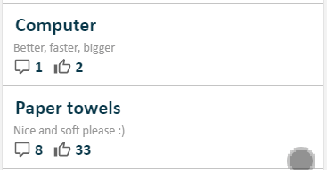

<h1 align="center">react-swipeable-list</h1>
<h4 align="center">Swipeable list component for React.</h4>
<p align="center">
  </img>
</p>

<p align="center">
  <a href="#demo">Demo</a> •
  <a href="#installation">Installation</a> •
  <a href="#usage">Usage</a> •
  <a href="#contributors-">Contributors</a>
</p>

<hr />

[](https://github.com/sandstreamdev/react-swipeable-list/actions)
[](https://greenkeeper.io/)
[](https://codecov.io/gh/sandstreamdev/react-swipeable-list)

[](#contributors)

## React Swipeable List component

A control to render list with swipeable items. Items can have action on left and right swipe. Swipe action triggering can be configured.

## Demo

Check [working example page](https://sandstreamdev.github.io/react-swipeable-list/) or experiment on:

[](https://codesandbox.io/s/github/sandstreamdev/react-swipeable-list/tree/master/examples)

## Installation

```bash
npm install @sandstreamdev/react-swipeable-list
# or via yarn
yarn add @sandstreamdev/react-swipeable-list
```

## Usage

```jsx
import { SwipeableList, SwipeableListItem } from '@sandstreamdev/react-swipeable-list';
import '@sandstreamdev/react-swipeable-list/dist/styles.css';

<SwipeableList>
  <SwipeableListItem
    swipeLeft={{
      content: <div>Revealed content during swipe</div>,
      action: () => console.info('swipe action triggered')
    }}
    swipeRight={{
      content: <div>Revealed content during swipe</div>,
      action: () => console.info('swipe action triggered')
    }}
  >
    <div>Item name</div>
  </SwipeableListItem>
</SwipeableList>
```

NOTE: `SwipeableListItem` can be used without `SwipeableList` but swipe blocking on scroll needs to be handled.

## SwipeableList Props

### scrollStartThreshold

Type: `number` (default: `10`)

How far in pixels scroll needs to be done to block swiping. After scrolling is started and goes beyond the threshold, swiping is blocked.

It can be set for the whole list or for every item. See `scrollStartThreshold` for `SwipeableListItem`. Value from the `SwipeableListItem` takes precedence.

### swipeStartThreshold

Type: `number` (default: `10`)

How far in pixels swipe needs to be done to start swiping on list item. After a swipe is started and goes beyond the threshold, scrolling is blocked.

It can be set for the whole list or for every item. See `swipeStartThreshold` for `SwipeableListItem`. Value from the `SwipeableListItem` takes precedence.

### threshold

Type: `number` (default: `0.5`)

How far swipe needs to be done to trigger attached action. `0.5` means that item needs to be swiped to half of its width, `0.25` - one-quarter of width.

It can be set for the whole list or for every item. See `threshold` for `SwipeableListItem`. Value from the `SwipeableListItem` takes precedence.

## SwipeableListItem Props

### blockSwipe

Type: `boolean` (default: `false`)

If set to `true` all defined swipe actions are blocked.

### swipeLeft

Type: `Object`

Data for defining left swipe action and rendering content after item is swiped. The object requires following structure:

```js
{
  action,  // required: swipe action (function)
  content, // required: HTML or React component
}
```

### swipeRight

Type: `Object`

Same as `swipeLeft` but to right. :wink:

### scrollStartThreshold

Type: `number` (default: `10`)

It can be set for the whole list or for every item. See `scrollStartThreshold` for `SwipeableList`. Value from the `SwipeableListItem` takes precedence.

### swipeStartThreshold

Type: `number` (default: `10`)

How far in pixels swipe needs to be done to start swiping on list item. After a swipe is started and goes beyond the threshold, scrolling is blocked.

It can be set for the whole list or for every item. See `swipeStartThreshold` for `SwipeableList`. Value from the `SwipeableListItem` takes precedence.

### threshold

Type: `number` (default: `0.5`)

It can be set for the whole list or for every item. See `threshold` for `SwipeableList`. Value from the `SwipeableListItem` takes precedence.

## Contributors ✨

Thanks goes to these wonderful people ([emoji key](https://allcontributors.org/docs/en/emoji-key)):

<!-- ALL-CONTRIBUTORS-LIST:START - Do not remove or modify this section -->
<!-- prettier-ignore-start -->
<!-- markdownlint-disable -->
<table>
  <tr>
    <td align="center"><a href="https://github.com/sandstreamdevelopment"><br /><sub><b>sandstreamdevelopment</b></sub></a><br /><a href="#business-sandstreamdevelopment" title="Business development">💼</a> <a href="#financial-sandstreamdevelopment" title="Financial">💵</a> <a href="#ideas-sandstreamdevelopment" title="Ideas, Planning, & Feedback">🤔</a></td>
    <td align="center"><a href="https://github.com/marekrozmus"><br /><sub><b>Marek Rozmus</b></sub></a><br /><a href="https://github.com/sandstreamdev/react-swipeable-list/commits?author=marekrozmus" title="Code">💻</a> <a href="https://github.com/sandstreamdev/react-swipeable-list/commits?author=marekrozmus" title="Documentation">📖</a> <a href="https://github.com/sandstreamdev/react-swipeable-list/commits?author=marekrozmus" title="Tests">⚠️</a> <a href="#example-marekrozmus" title="Examples">💡</a> <a href="#ideas-marekrozmus" title="Ideas, Planning, & Feedback">🤔</a></td>
    <td align="center"><a href="https://github.com/jakubbogacz"><br /><sub><b>jakubbogacz</b></sub></a><br /><a href="https://github.com/sandstreamdev/react-swipeable-list/pulls?q=is%3Apr+reviewed-by%3Ajakubbogacz" title="Reviewed Pull Requests">👀</a> <a href="#ideas-jakubbogacz" title="Ideas, Planning, & Feedback">🤔</a> <a href="https://github.com/sandstreamdev/react-swipeable-list/commits?author=jakubbogacz" title="Documentation">📖</a></td>
    <td align="center"><a href="https://github.com/LukasMarx"><br /><sub><b>Lukas Marx</b></sub></a><br /><a href="#ideas-LukasMarx" title="Ideas, Planning, & Feedback">🤔</a></td>
    <td align="center"><a href="https://www.linkedin.com/in/luis-filipe42/"><br /><sub><b>Luis Filipe Pedroso</b></sub></a><br /><a href="https://github.com/sandstreamdev/react-swipeable-list/issues?q=author%3ALuisFilipePedroso" title="Bug reports">🐛</a></td>
    <td align="center"><a href="https://github.com/przemyslawzalewski"><br /><sub><b>Przemysław Zalewski</b></sub></a><br /><a href="#maintenance-przemyslawzalewski" title="Maintenance">🚧</a> <a href="https://github.com/sandstreamdev/react-swipeable-list/pulls?q=is%3Apr+reviewed-by%3Aprzemyslawzalewski" title="Reviewed Pull Requests">👀</a></td>
    <td align="center"><a href="https://marktension.github.io/tension_design/"><br /><sub><b>MarkTension</b></sub></a><br /><a href="https://github.com/sandstreamdev/react-swipeable-list/issues?q=author%3AMarkTension" title="Bug reports">🐛</a></td>
  </tr>
  <tr>
    <td align="center"><a href="https://github.com/wildeyes"><br /><sub><b>wildeyes</b></sub></a><br /><a href="https://github.com/sandstreamdev/react-swipeable-list/issues?q=author%3Awildeyes" title="Bug reports">🐛</a></td>
  </tr>
</table>

<!-- markdownlint-enable -->
<!-- prettier-ignore-end -->
<!-- ALL-CONTRIBUTORS-LIST:END -->

This project follows the [all-contributors](https://github.com/all-contributors/all-contributors) specification. Contributions of any kind welcome!
